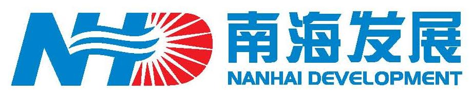

===========================
南海发展企业文档库
===========================

润普为南海发展股份有限公司提供企业文档库解决方案

项目背景
=============

`南海发展 <http://www.nhd.net.cn>`__ 是一家以经营自来水的生产、供应及路桥投资等公用事业、基础设施为主的上市公司(证券代码:600323)。

润普公司于2006年7月，为南海发展提供了企业文档库实施服务。

总的来说，整个项目分为 *文档库* 和 *企业内部信息门户* 两个部分。本次项目重点是文档库。整个文档库的管理主要包括 公司级、部门级、项目级三部分. 

项目建设目标
=================
1. 把公司的制度、流程、规定、文件、单据、报表等分类存放。
2. 把部门的规定、操作手册、单据、报表等规范好。
3. 把公司的项目信息管理好。
4. 提供文档分类存储、版本管理、权限管理、全文搜索等功能，达到信息共享的目的。

文档管理的需求
=====================
* 支持海量文档的可靠存储
* 支持文档的分类
* 能够方便灵活的进行权限管理
* 支持全文搜索
* 支持版本管理
* 在浏览器上直接查看文档
* 和桌面编辑器集成

系统部署环境
==================
- Windows 2003 Server
- 和企业活动目录进行集成
- 和sendmail邮件系统集成
- 使用  `veritas <http://www.veritas.com/zh/CN/>`__  软件对系统进行备份

未来的发展
===================
逐步发展为内部信息平台，也就是企业信息门户：

* 从数据库提取信息展示
* 多个BS系统的单点登录（用户/密码统一）
* portlet方式展现数据
* 个性化配置
* 与Java开发的系统进行一定的集成
