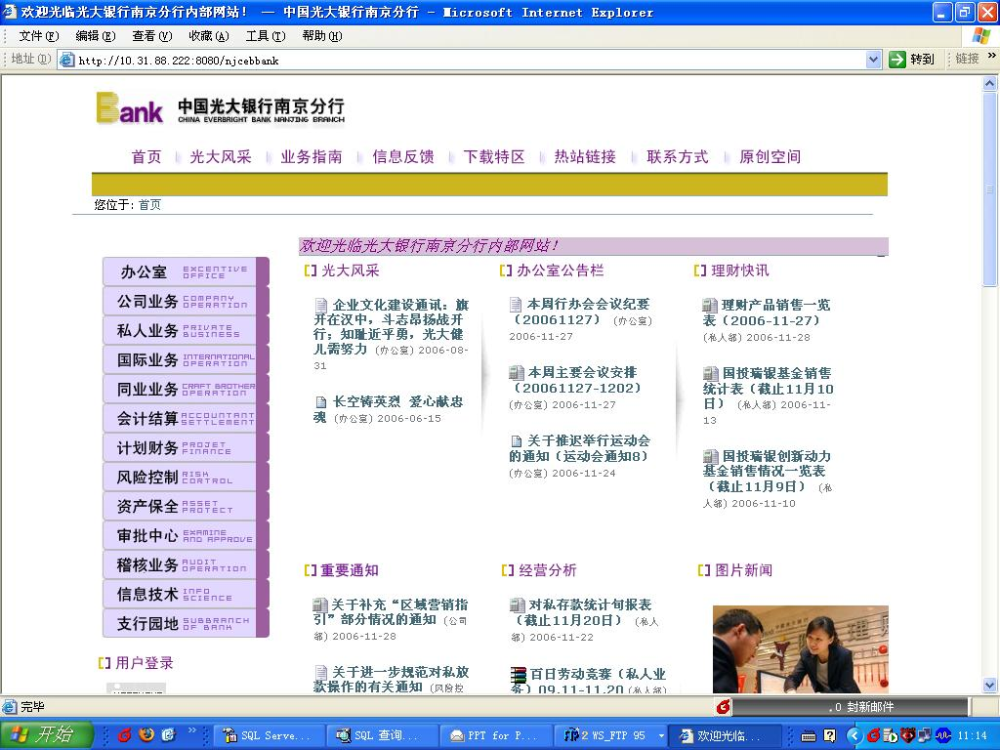

---
created:
  creators:
  - admin
  description: 润普公司为南京光大银行提供了内部网建设咨询服务
  modified: '2006-11-28 20:10:36'
  title: 南京光大银行内部网
creator: admin
description: 润普公司为南京光大银行提供了内部网建设咨询服务
title: 南京光大银行内部网
---

`中国光大银行 <http://www.cebbank.com>`__ 是国内第一家国有控股并有国际金融组织参股的全国性股份制商业银行，在全国23个省、自治区、直辖市的36个经济中心城市拥有分支机构370多家，成为对社会有一定影响的全国性股份制商业银行。

润普公司为光大银行南京分航提供了内部网建设的咨询服务。经过润普公司的专业培训和服务，南京分航科技部在不到一个月的时间内，顺利安装、部署的网站，并对站点的外观进行了个性化的定制，掌握了系统的使用管理方法，顺利部署了系统。

南京分行共有数百人，包括办公室、私人部、风险控制部等数个部门。各部门定期将文档发布到网站，网站还提供了新闻、投票、留言、论坛、个人空间等功能。

南京分航内部网极大的方便了公司内部的沟通和信息发布，有效地提升公司的管理水平。
