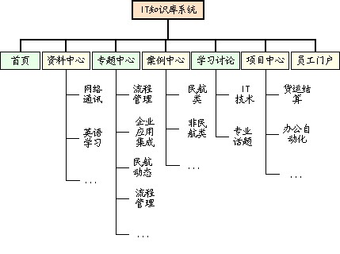
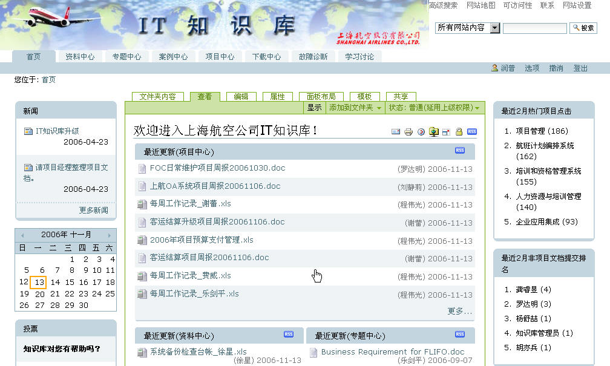
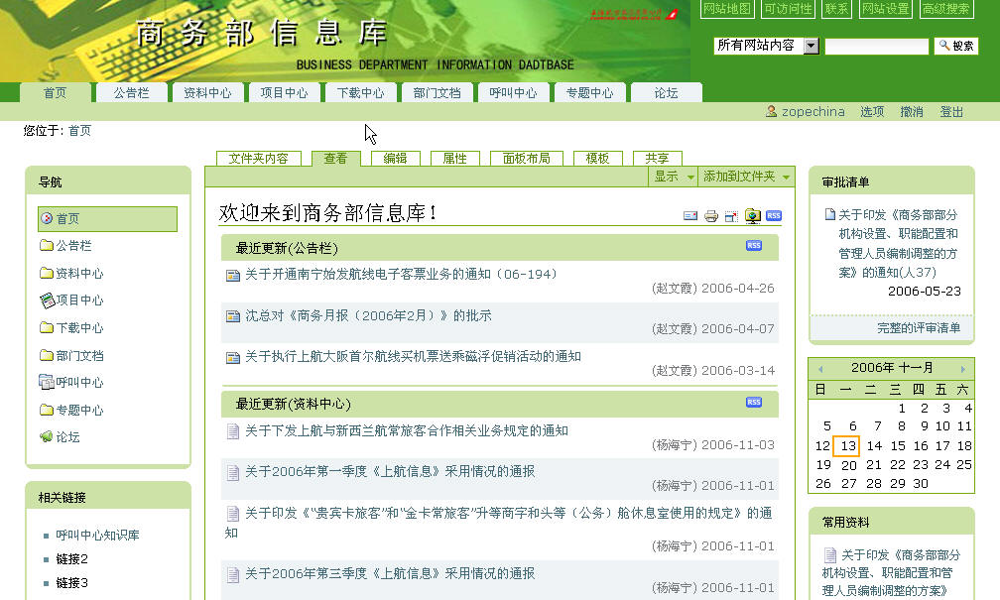

---
created:
  creators:
  - admin
  description: IT知识库系统可统一管理技术知识、资料和项目，建立部门信息门户。该系统，是IT部员工的一个综合的知识门户系统。
  modified: '2006-11-29 22:23:11'
  title: 上海航空IT知识库项目
creator: admin
description: IT知识库系统可统一管理技术知识、资料和项目，建立部门信息门户。该系统，是IT部员工的一个综合的知识门户系统。
title: 上海航空IT知识库项目
---
客户简介
==========
上海航空股份有限公司成立于1985年，是中国第一家多元投资的商业性有限责任航空企业，于2002年A股上市。目前，上航已开辟了100多条国内航线，以及数个国际航线。公司以其良好的安全记录、高质量的服务水准和先进的企业文化和卓有成效的经营管理，取得了较好的经济效益和社会效益。

项目背景
=====================
上航公司内部长期从事IT工作的人员接近60人，每个人都可能在工作的过程中积累了大量的资料和经验，但是并没有做到及时的整理和集中，没有提升为组织知识的层面，相关知识资料的分布属于一种游离分散的状态，缺乏统一的管理。

从而造成了以下一些问题：

- 以前的工作成果无法找到、导致重复工作
- 随着时间推移、员工流动，导致知识流失
- 新员工基本要靠自己摸索学习，成长速度慢
- 项目成员之间无法很好地共享文档、知识、动态进展情况
- …………

为此，上航信息技术部决定在公司内部建立IT知识库，实现对IT知识的统一管理和利用。

凭借系统的强大功能、源代码开放等特性，凭借快速优质的服务，润普从众多竞争对手中脱颖而出，博得客户的青睐，为客户提供IT知识管理解决方案。

系统介绍
================
IT知识库系统可统一管理技术知识、资料和项目，建立部门信息门户。该系统，是IT部员工的一个综合的知识门户系统。

以专题、案例等形式，对部门业务相关的知识文档资料统一组织、统一管理；通过项目中心，为各项目建立项目门户网站；建立内部讨论区，加强知识共享、交流。

系统结构如图示：

重点介绍其中几个模块：

- 项目中心：集中管理信息系统项目，搭建项目门户网站、项目任务跟踪统计、文档管理与项目信息发布；

- 专题中心：以门户的形式把一组相关的知识组织起来，集中管理。各专题由相关专家负责管理；

- 员工门户：将与当前用户相关的信息，分类呈现，包括“我的收藏”、“我的项目”、“我的任务”等。

系统用户
=======================
- 公司员工用户：

  - 查看相关授权项目的资料和文档，协同参与项目；
  - 参与专题学习、交流和积累；
  - 查看、贡献相关的技术资料；
  - 查看各部门通知新闻，浏览相关部门内部的文档。

- 项目的合作伙伴：

  协同参与相关的项目，查看项目中相关的授权资料，上载相关项目文档。

- 内部非系统用户：

  无需登录便可访问公司新闻、公司各部门的公开信息，以及项目中的公开介绍信息。

应用效果
=====================
这个系统将提升IT部门的项目管理水平和执行能力，积累沉淀部门各种知识，提升员工素质，优化部门管理，最终提升信息化部门的整体能力。系统能平滑扩展到上航整个公司，能为以后上航建立全面的知识组织体系打好基础。

系统于2004年4月正式投入使用。2005年三月我们将系统升级至Plone 2.1。上航其他部门，如商务部门，也开始使用本系统。知识库系统逐步被公司其他部门接受和使用。

系统界面截图
=====================

   
   上航IT知识库首页

   上航商务部知识库首页
