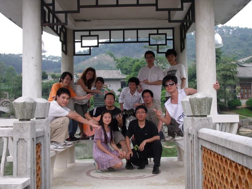

---
created:
  creators:
  - panjy
  description: 2009.5.30日，润普公司在端午节，组织前往暨仁山庄度假游玩。
  modified: '2009-06-03 19:50:22'
  title: 活动快讯 - 暨仁山庄之行
creator: panjy
description: 2009.5.30日，润普公司在端午节，组织前往暨仁山庄度假游玩。
title: 活动快讯 - 暨仁山庄之行
---
===========================================
活动快讯 - 暨仁山庄之行
===========================================

上海润普公司是一个走在时代前沿的公司，公司一直凭着先进的理念在这个高科技支撑的时代大道上快速前行。公司的发展始终坚持以人为本的理念，特别注重团队的建设及其员工的福利，始终把员工的“劳”与“逸”进行有机的结合，公司管理层的思想是让员工在开心中工作，在愉快中成长。

近日，在中国的传统端午节之时，公司把远离家人的全体员工紧紧的拥抱在一起，组织了一次欢快而又活泼的度假之旅活动。活动在风景宜人的暨仁山庄里面举行，在活动期间公司的全体上下一起举办了娱乐的游泳、卡啦ok、划船、登山等活动，学习的营销培训、产品培训、技术培训等活动，在活动的期间还品尝了大自然口味美食，让大家在这佳节期间少了一份孤单、多了一份愉快！

通过这次活动，大家不仅身心愉悦，精神上更是倍受鼓舞，而且更让我们所有同事团结在一起，真正让我们体会到家的温暖、亲人般的爱，大家更有信心将易度创办成真正有用的企业，开发出真正有用的产品，携手共创中国第一SAAS品牌是润普公司全体成员的奋斗目标。

