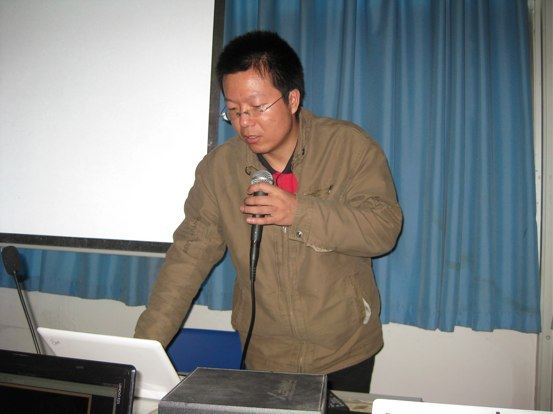
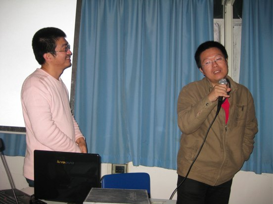
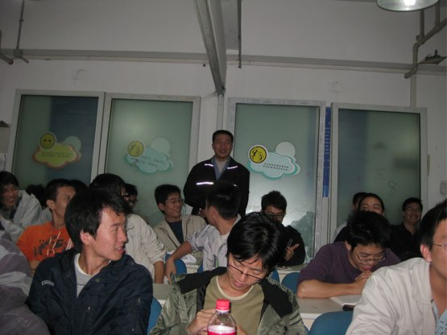

==========================================
润普技术总监潘俊勇点评云计算
==========================================

2009年11月14日下午14：30，广州技术沙龙第三期在广州中山大学国家科技园成功举行。广州技术沙龙作为珠三角地区的 web、游戏开发人员自发组织的线下社区交流活动，已成功举办三期，活动旨在提供一个开放、协作的交流空间，让成员可以踊跃参与、发表、交流，活动举办后，大家可通过 twitter、python-cn maillist 和 blog 进行持续交流。

本期沙龙广州易度的潘俊勇先生应邀作为主讲人之一。作为中国Python社区的领军人物，CZUG的创始人，润普公司技术总监潘俊勇在社区具有极高的威望，他开创的CZUG开源社区倡导开放与协作的社区文化，通过建立网络交流环境、组织技术研讨会等，设法扩大zope在中国的影响，提供更多的宣传资料，共同开发中文化的zope产品。而广州润普公司作为一个开源公司，一直在开源领域非常活跃，积极参与社区的各种活动。所以本期潘俊勇先生受邀参加技术沙龙主讲《云时代的软件》，吸引了众多行内精英技术人员慕名而来。来自广州、珠海、深圳等珠三角城市的许多精英技术人员参加了此次活动，包括来自网易、金山、新浪、4399.com、腾讯等公司的开发人员，以及各大高校的同学们。

图为：润普公司技术总监，易度网核心人物潘俊勇先生演讲

在活动中潘俊勇先生发表了题为《云时代的软件》演讲，在演讲中首先回首了软件革命的动荡历史，引入了云计算的概念，接着分析了云时代的发展趋势，带领大家认识了云时代国内外的先驱，接着分析了云商业模式、云产品、云开发模式的转变，最后着重介绍了Pass脚本开发及Pass产品在云时代的发展趋势。潘俊勇先生的Pass分析解决了小企业不愿意迁移到SaaS的问题。他在演讲中分析了云脚本的新契机，包括平台租用，无价格障碍；平台开放；免费战略和利润分成，能吸引大量小开发商。在这个契机下，Pass产品包括百会、易度等，必将解决中小企业的软件领域问题。

这篇演讲是国内讲解云计算最深入、最透彻的一篇，特别是对PaaS从背景到实践全面的解析，得到了活动现场所有参与者的高度赞赏和认可，活动现场掌声不断，大家踊跃提问，气氛异常激烈，大家都被潘俊勇先生对云计算如此精彩的讲解所吸引，以致之后应大家邀请返场继续讲解ZODB相关技术。

图为：潘俊勇先生应大家邀请返场讲解ZODB相关技术

沙龙活动期间，大家都有了自我介绍和露脸机会，促进了大家的线下交流活动。

技术沙龙活动举办后，大家通过 twitter、python-cn maillist 和 blog对潘俊勇先生的这篇精彩演讲进行了后续的沟通交流，线下交流效果十分显著，大家纷纷分表博客留言，期待潘俊勇先生的下次精彩演讲，也有的博主发表留言称没有参加此次活动听其演讲而感到遗憾。

如果大家想了解此次活动的更多信息，可参考如下链接地址。

1. `潘俊勇《云时代的软件》幻灯讲稿 <http://czug.org/blog/panjy/2009/software-in-cloud.rst/@@blogpost.html>`__

2. `广州技术沙龙概况链接 <http://blog.laiyonghao.com/2009/10/programming-tech-party/396>`__

3. `潘俊勇对云计算的焦点关注博客 <http://czug.org/blog/panjy/>`__

