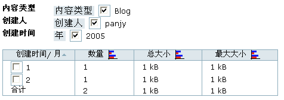
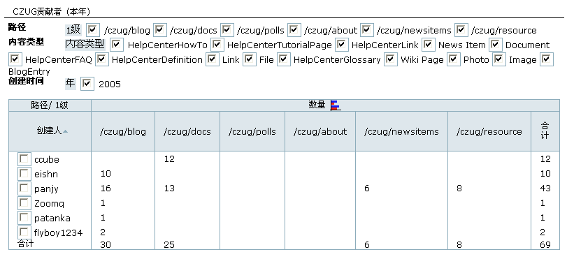
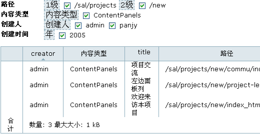
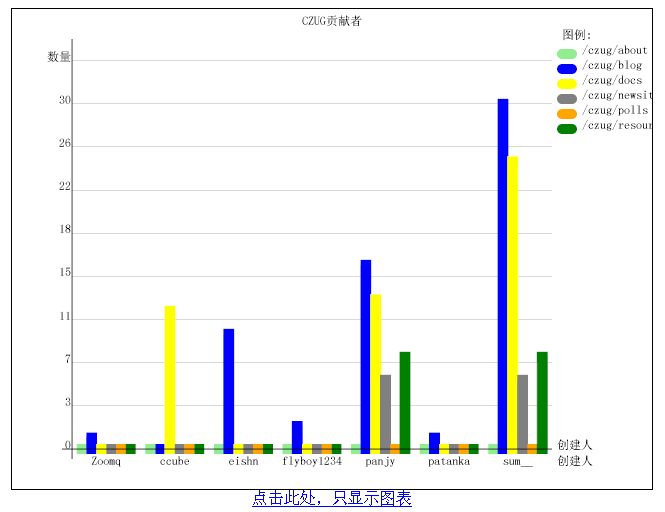
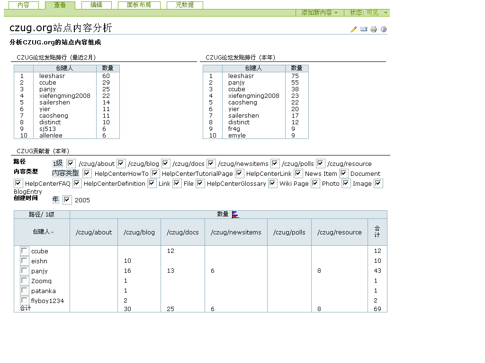

---
created:
  creators:
  - panjy
  description: 通用的数据挖掘和统计分析工具。支持对ZODB数据库和关系数据库的挖掘和分析，提供基于Plone的分析界面。自带对Plone网站内容组成、用户点击次数、用户访问次数的分析功能。
  modified: '2006-10-27 02:08:28'
  title: 'ZOpen Analyzer: 统计分析器'
creator: panjy
description: 通用的数据挖掘和统计分析工具。支持对ZODB数据库和关系数据库的挖掘和分析，提供基于Plone的分析界面。自带对Plone网站内容组成、用户点击次数、用户访问次数的分析功能。
title: 'ZOpen Analyzer: 统计分析器'
---

:产品名称: 统计分析器（ZOpen Analyzer）
:许可类型: 商业许可
:发布类型: Plone扩展产品, Python包
:Plone版本: Plone 2.0以上
:产品版本: 1.0 版本
:操作系统: Windows, Linux, Unix, Mac OS
:购买联系: sales@zopen.cn

基于数据挖掘原理设计
====================
ZOpen Analyzer基于数据挖掘的理论构建，他通过定义多级别维度(统计方法)和度量值(统计值)来建立多维数据集分析模型，用户能任意组合维度和度量值进行分析，进而能够满足用户的各种分析要求，从数据中获取任意“不确定”的信息。

同时支持ZCatalog和SQL
===========================
- 通过Plone的ZCatalog，实现对Plone内容的分析
- 通过SQL实现对关系数据库表格的分析

单维分析
================
针对一个维度分析，实现常规统计表格

纵横表分析
================
同时针对两个维度进行分析，以纵横统计的形式展现

多分析器跳转
================
不同的分析器直接可进行跳转，跳转时自动继承前一个分析器分析设置条件，以保证分析的连续性。

细节分析
================
支持细节分析，可分析到最小的数据记录

图表展现
================
系统支持以SVG格式，图形化显示分析结果。

分析结果展现
================
分析器可以和 `内容面板`_ 结合，提供如下几种视图，展现分析结果：

- 最近2月，以及本年的排名情况
- 最近2月，以及本年的分析报告
- 直接查看预设条件的分析报告

Plone网站内容统计分析
=============================
ZOpen Analyzer产品自带可对网站访问日志文件进行分析，支持日志中的虚拟主机地址转换。

通过创建人员、创建时间、内容类型、位置、状态等的分析，可获得如下信息：

- 人员/部门的知识贡献情况
- 各个版面的内容分布
- 文件大小的统计

.. _`内容面板`: /products/CMFContentPanels
