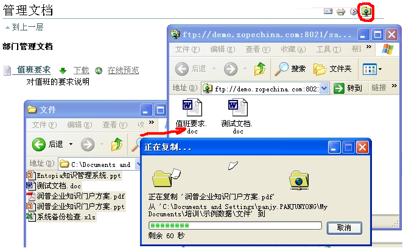

==========================
易度文档管理系统
==========================

对文档提供获取、管理、存储、分发的全生命周期管理

.. image::  img/zopen-EDM-160.jpg 
   :class: image-right image-noborder
   :height: 120

EDO Docs是润普公司针对企业文档管理开发的一个即装即用的产品。

使用EDO Docs文档管理系统，能够可靠地集中存储企业的海量文档，委托权限管理，支持文档的元数据，提供多种的文档挖掘线索，提供多种文档展现方法，支持文档审核流程，能最终提高工作效率、减少重复工作、加强部门之间的沟通，有效的管理企业最重要的智力资产 － 文档。

`查看易度文档管理系统最新版本 <http://edodocs.com>`__ 

   Flash演示(一)

   Flash演示(二)

EDO Docs文档管理系统的典型适用领域包括：学校、咨询公司、律师事务所、监理公司、开发部门、市场部门、企业文档管理和控制部门、服务和支持部门、呼叫中心、金融企业

.. sectnum::
   :depth: 1
.. Contents:: ZOpen EDM产品特性清单如下:
   :depth: 1

易用
================
易用的Web界面
-------------------------
所有文档，可直接通过浏览器访问，网站界面类似Windows资源管理器。Web界面非常易用，最终用户免安装，免使用培训。

即便出差在外，只要开通网络端口，也可通过https安全连接访问网站。

集成的FTP批量文件拖放
-----------------------

在IE浏览器中点击网页上的链接，无需二次登录，可直接激活windows的web文件夹，使用Windows资源管理器来进行批量上传、下载。

和桌面编辑器集成
----------------------

在网页上点击“编辑”链接，可直接激活word等编辑器进行编辑，可自动保存文件到服务器。

此功能大大简化通常的文件下载、编辑、上传的复杂过程，实现了和桌面编辑器的无缝集成。

文档预览
---------------
直接在浏览器中预览word、PPT、PDF等格式的文件，用户甚至不必安装相应的桌面编辑软件。

此功能简化了文档的下载、打开的繁琐(耗时)过程，方便文档的查看。

邮件发送
-----------
点击网页发送图标，可直接在网站上，通过填写表单发送文件邮件到指定地址。

可查找网站集成的用户邮件地址薄，选择接收用户的邮件地址。用户不必借助任何其他工具，可方便发送文件。

文件夹视图切换
---------------------
提供类似Windows的文件夹视图切换功能，提供一组文件夹视图，包括标准、表格、缩略图、时间线索等。

其中缩略图非常适合照片的展现。

剪切、复制、粘贴、改名
-----------------------
提供一组类似Windows资源管理器的文件管理操作，包括剪切、复制、粘贴、改名等。

个性化信息推送
----------------
- 个人桌面：展现个人的收藏、最近创建的内容等
- RSS：个人订阅网站最新内容

数据的存储
====================
海量文档集中可靠存储
-------------------------
所有文档均使用 `润普文件库系统 <http://zopen.cn/products/frs>`__ 以文件的形式存放在服务器的文件系统中，服务器定期对文档库进行备份。即便服务器宕机，仍然可直接从文件系统中得到所需要的文档。

- 可扩容、格式开放的文件系统存储格式
- 可根据需求柔性部署
- 可和NAS设备良好集成

支持各种文档格式
----------------
各种大小、各种格式的文档，包括常见的Word、PPT、PDF、HTML、图片等格式，以及音频、视频文件。

丰富的元数据管理
---------------------
保留文档的标题、描述、作者、创建时间、修改时间，生效和失效时间、分类等各种元数据，支持全套都柏林元数据标准。

这些文档的属性信息是对文档的补充说明，同时这些信息也可以用于文档的搜索。

废件箱
--------------
废件箱提供安全的删除机制，避免误操作导致的数据丢失。删除内容自动放入废件箱内，可撤销删除操作。

版本管理
---------------
.. image:: img/frs-revisions.png
   :alt: 文件存档
   :target: img/frs-revisions.png
   :width: 220

可将文档阶段性的历史版本可存档起来，供将来查阅。

产品支持和 `bazaar <http://bazaar-vcs.org/>`__ (`中文 <http://bazaar-vcs.org/%E4%B8%AD%E6%96%87>`__)等专业版本管理工具集成，实现高级的版本管理功能，包括版本分支、修改历史、文件同步等功能。

个人空间
-------------
可为每个用户提供一定配额的空间，可存放个人的文档，或者对个人重要文档进行备份。

中文全文搜索
==================
支持对常用的Word/Excel/PPT/PDF等格式文档进行全文搜索，可搜索到文件内部的文字。

权限和流程
================
柔性、安全、易管理的权限控制
-----------------------------------
委托权限管理
  不再由系统管理员进行集中的权限管理，而是为各个栏目/文件夹指派管理人员，委托他们进行管理。这大大优化的系统管理的可操作性。

成组分配权限
  可按照部门的组织结构，为用户分组，成组分配权限，简化权限的分配和管理。当然，系统也支持直接针对个人授权。

细粒度的权限控制
   可针对单个文件夹、甚至单个文档分配权限；可为文件夹设置不同的安全级别，如内部、保密、公开等。

协同工作
   系统提供“贡献者”角色，某文件夹下拥有该角色的人员，能够添加新的内容，能够修改自己添加的内容，但是不能修改和删除其他人添加的内容。该角色能够很好的支持团队协同知识贡献。

本地组
  对于项目中的动态团队，项目经理自己就可以开设项目组，调整项目组员，而无需网站管理员的协助。

高度可定制的文档审核流程
-----------------------------------
可定制，支持会签、多审等各种流程。文档在审核流程中会处于不同的状态，在各个状态，用户对文档的权限会发生变化。比如一旦文档发布，就不允许作者随便修改了。

.. image:: img/workflow.png
   :target: img/workflow.png
   :width: 220

知识管理
=================
分类管理
---------
可对文件夹中的文件进行分类管理，一个文档可同时属于多个分类。可针对分类进行查询、统计。

文档评注和评分
----------------------
用户可对单个文档进行评注和评分，这些信息可反馈到文档作者，对文档进行优化。评注信息会采用邮件自动通知给作者。

知识挖掘
-----------------
根据用户的评分数据，以及对文档的下载次数，可提供优质、待改进、受欢迎文档的清单，实现对海量文档的挖掘和分析，便于对文档进行清理。

.. image:: img/mining.png
   :target: img/mining.png
   :width: 220

统计
----------------

系统支持完善的统计分析功能，支持两种分析：

1. 对知识资源的统计分析

   通过创建人员、创建时间、内容类型、位置、状态等的分析，可获得如下信息：

   - 人员的知识贡献排名，可激励知识贡献
   - 各个版面的内容分布
   - 文件大小的统计

2. 用户访问情况的分析

   通过各个时间段、各用户对网站各个部分的访问情况的分析，获得：

   - 哪些内容版面受欢迎
   - 哪些人员经常使用系统等信息
   - 系统的整体使用情况
   - 各个月的访问情况变化

对于分析的结果，可在面板页面中直接显示，或者以排名的形式显示。

适合企业级部署
=======================
多语言支持
---------------

系统支持多种语言，特别是支持中文、英文、日文等常用语言有比较好的支持。

易安装
----------------
- 6分钟即可完成安装，开始使用
- 系统的维护管理自动化

用户帐号集成
---------------
企业往往需要上多套信息系统，如果每个系统都有独立的用户管理，这样使用和管理将会非常复杂。

系统和Windows活动目录采用LDAP进行集成，也可和现有数据库中的用户帐号集成，这样可减少帐号管理的工作量。

基于成熟的平台
-----------------
基于优秀的开源内容管理系统 `Plone </technology/zope/AboutPlone>`__ ：易用、多语言支持、功能强大、得到广泛支持、大量成熟应用.

系统可扩展
-------------------
Plone有大量的免费或者商业的插件产品供选用，可用于内部网信息发布、项目管理、知识管理等方面，更可扩展开发定制的应用。
