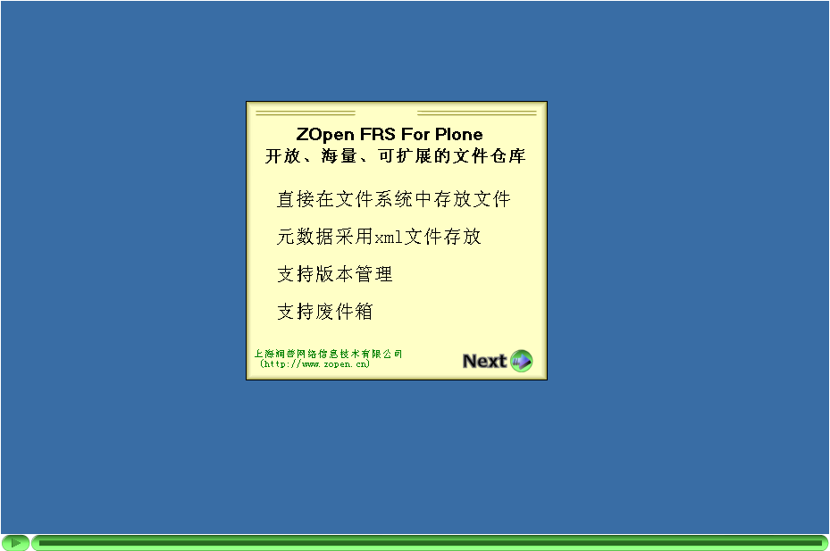
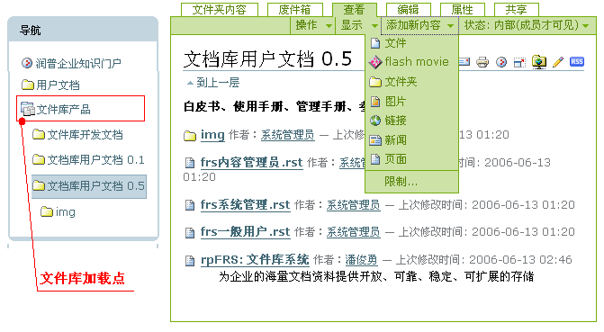
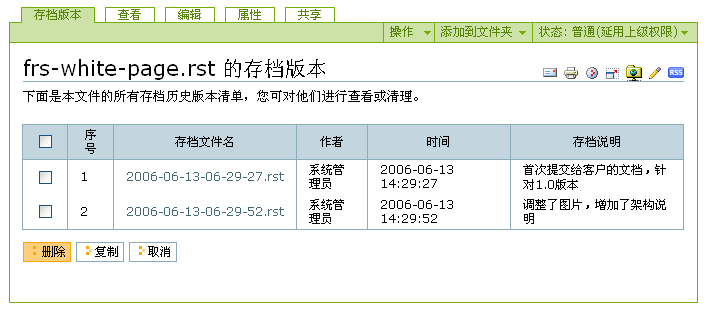
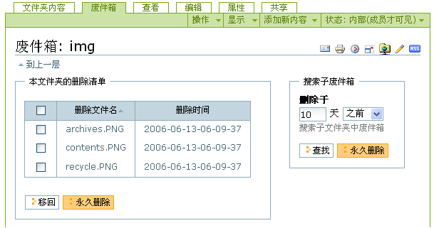
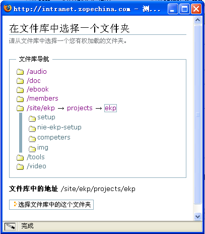
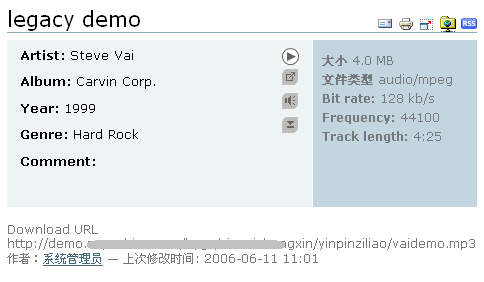

======================
ZOpen FRS: 文件库系统
======================

为企业的海量文档资料提供开放、可靠、稳定、可扩展的存储

.. image:: img/zopen-frs.gif
   :class: image-right image-noborder

:产品名称:     文件库系统（ZOpen FRS）
:许可类型:     商业许可
:发布类型:     Plone扩展产品
:Plone版本:    Plone 2.1
:产品版本:     1.0 版本
:操作系统:     Windows2000/XP/2003, Linux, Unix, Mac OS
:购买联系:     sales@zopen.cn

ZOpen FRS让Plone支持海量内容可扩展透明存储。使用ZOpen FRS，可让Plone的内容直接保存在文件系统中，内容的元数据(属性)也以xml文件的格式保存在文件系统。你可轻松将现有的Plone内容导出到文件系统中。ZOpen FRS也支持版本管理和废件箱功能。 

   文件库产品Flash功能演示

Plone网站的内容默认存放在一个叫做ZODB的对象数据库中；其他的内容管理系统，大都在传统的关系数据库系统中存放数据。

无论是对象数据库，还是关系数据，在企业内容管理领域，均存在一些共同的问题：

* 企业往往拥有大量的各种文档和资料，而且不断增长; 海量的数据会导致数据库迅速膨胀，数据的压缩、备份、分割、转移都比较困难，数据库成为系统的高危点
* 无论是ZODB，还是关系数据库，都不大适合存储大文件。大文件会导致系统性能下降；
* 需要运行私有数据库软件，才能访问内容；特别的，ZODB仍然是一个黑箱，没有简单的访问接口，访问企业最宝贵的文档资料，目前必须依赖于CMF/Plone/Zope3这套复杂的软件栈。

  - 一旦软件出现意外故障，则除了修复软件故障外，没有其他的途径读取网站任何内容;
  - 难以进行网站内容的升级、迁移。只有完全掌握相关软件的细节，才可能进行;
  - 难以和其他的软件集成，比如和其他成熟的版本管理系统、企业搜索服务器、流媒体服务器等集成;

.. Contents:: 产品特性：
.. sectnum::

文件系统开放存储
============================
ZOpen FRS以开放的格式直接在文件系统中保存内容，解决了数据库方式的存储问题：

- 内容（包括文件和文件的属性信息）直接存放在服务器的文件系统上。文件系统是存放和管理文件的最开放、最直接、最可靠的形式。
- 文件的属性信息，采用标准的 XML_ 格式，可方便地读取、交换、转换。
- 内部采用一个虚拟的文件系统，可以支持Window/Linux平台各种文件系统，支持各种编码(如GB/UTF-8)的中文文件名，能平滑地支持由于硬盘扩容或者平台迁移。

.. _XML: http://plone.org/documentation/tutorial/xml-in-plone-with-marshall/tutorial-all-pages

文件系统的开放存储格式，可以实现：

- 企业的文档资料能够以开放的格式永久存储，而不必依赖任何软件；即便服务器软件过时或者崩溃，文件仍然可直接从文件系统中安全访问，不会丢失任何信息

- 可扩容(Scalability)

  随着数据量的增长，磁盘空间可能被填满。可方便将文件库的部分内容转移到其他的硬盘、或者其他的服务器共享文件夹中。

- 可和NAS服务器集成，实现更可靠的存储，同时提供另外的CIFS、NAS、FTP接口。

- 可方便的将内容分发/迁移到到其他的Plone站点上，可实现多阶段(Multi-Stage)的内容发布

- 可方便将内容分发到其他的Jave/PHP/.NET等传统技术的内容发布平台上

- 支持所有的Plone标准内容类型；一般只需要4行代码，便可让其他的插件产品使用文件库存储。

- 简化进行数据迁移

  发现了更优秀的Plone插件产品？需要升级现有的内容？ZODB存储方式的升级，需要了解软件的很多细节，开发升级程序。

  采用文件库存储后，由于采用了标准的XML，非常方便使用xslt直接转换存储的数据，不需要掌握任何的Plone插件产品的知识。

- 更容易集成

  由于文件可直接访问，可方便的和其他的流媒体服务器集成；大文件可的访问，可和Apache的集成；也可轻松实现和其他的企业搜索引擎软件集成

和Plone透明集成
================================================
用户在使用文件库存储的时候，几乎感受不到文件库的存在。所有界面和操作方法均和Plone保持一致。

Plone和ZOpen ECM Server所有的文档管理功能，均可在文件库中使用，包括剪切/拷贝/粘贴、改名、添加、删除、工作流、权限管理、FTP/Webdav访问、外部编辑器集成等。

文件的归档和版本
========================
保存在文件库的内容，可对内容进行存档，保留阶段性的历史版本。

废件箱
===========
废件箱提供安全的删除机制，避免误操作导致的数据丢失。删除内容自动放入废件箱内，可撤销删除操作。

文件库的挂载(mount)权限
==========================
文件库需要通过Plone中的 ``文件库视图`` 内容，挂载到Plone后，才能对文件库进行各种操作。

为保证文件库和操作系统的安全性，需要对挂载的权限进行控制。
ZOpen FRS仅仅运行对虚拟文件系统中的文件夹进行挂载，同时提供一套简单可行的挂载权限控制方法，能够保证文件库管理的安全性。

Plone内容导出
====================
如果您希望将现有的Plone站点内容导出到文件系统中，ZOpen FRS可帮助您。

您只需要拷贝ZODB中内容，并粘贴到文件库文件夹中，就可实现批量的导出！

支持大文件和流媒体
===========================
- 支持大文件的高效上传、下载
- 支持断点续传
- 和其他Plone插件产品集成，支持MP3/Flash/视频文件的在线播放

和 ATVideo_ 的集成示例

和 ATAudio_ 的集成示例

和 ATFlashMovie_ 的集成示例

.. _ATVideo: http://plone.org/products/atvideo
.. _ATAudio: http://plone.org/products/ataudio
.. _ATFlashMovie: http://plone.org/products/atflashmovie
