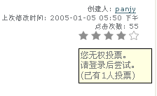

---
created:
  creators:
  - panjy
  description: 为基于Archetypes的产品提供投票的功能，ATRatings底层接口由Geoff Davis创建，润普公司对该产品进行维护并完成了产品的使用界面。
  modified: '2006-08-09 08:56:51'
  title: ATRatings：投票和计数器
creator: panjy
description: 为基于Archetypes的产品提供投票的功能，ATRatings底层接口由Geoff Davis创建，润普公司对该产品进行维护并完成了产品的使用界面。
title: ATRatings：投票和计数器
---
:产品名称: 投票和计数器（ATRatings）
:许可类型: 开源许可
:发布类型: Plone扩展产品
:Plone版本: Plone 2.0
:产品版本: 0.2a
:操作系统: Windows, Linux, Unix, Mac OS
:源代码: `collective/ATRatings`__
:免费下载: `atratings-0_2a.tgz`__

__ http://cvs.sf.net/viewcvs.py/collective/ATRatings

__ http://download.zopen.cn/atratings-0_2a.tgz

.. Contents:: 目录：

产品说明
=============
ATRatings是一个存储用户评分和点击数据的工具。

他采用了一个可适配的存储机制。目前仅仅提供ZODB的方式进行存储。

安装
==========
1. 下载产品
2. 解压缩，拷贝到Zope实例的Products目录中
3. 重新启动服务器
4. 在Plone界面->Plone设置->安装、卸载产品中，安装ATRatings

使用
==========
1. 开启投票或点击计数功能

   ATRatings默认禁止该功能。你可以到ZMI中，进入希望开启该功能的文件夹下，在properties标签页面中, 添加2个boolean类型的属性:

   - enableRatings : 是否启动投票功能
   - enableCountings : 是否启动点击计数功能

2. 一旦打开后，你可以在文档右下方的document_by_line处看到投票和点击计数信息。如果有权限，您也可以参与投票。

3. 添加统计面板

   在ZMI属性页面的left_slots或right_slots中添加两个2面板::

     portal/path/to/folder/portlet_top_ratings
     portal/path/to/folder/portlet_top_countings

   您也可以在CMFContentPanels中，使用更简单的方法，实现类似的功能。

4. 控制是否能够投票的权限为： "ATRatings: Add rating"

5. 在portal_ratings中，可设置allowed_rating_types和'allowed_couting_types', 控制什么内容类型可以投票或点击计数。

截图
============

作者
========
Geoff Davis
  产品的创建人，完成系统的可适配的存储架构，完成主要的接口

潘俊勇
  维护人员，修正bug，增加界面，完善接口，使得产品可用
