---
created:
  creators:
  - panjy
  description: 内容面板的基本操作和使用
  modified: '2006-11-22 09:50:12'
  title: 《内容面板的使用》
creator: panjy
description: 内容面板的基本操作和使用
title: 《内容面板的使用》
---
.. Contents::
.. sectnum::

内容面板的用途
=====================
Plone网站和各个栏目首页，一般需要一以贯之，展现网站或栏目下各种动态信息。

*内容面板* 通过对内容的展现面板单元的简单拼装，无需任何编程知识，便可完成复杂的动态页面。

同时，使用“内容面板”，可直接在Plone界面中，设置模板模板左右列上的面板。

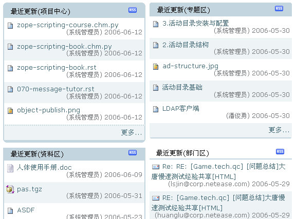

另外，可简单选择文件夹视图为 *内容面板视图* ，使用预设的显示模版来显示，如下图所示：

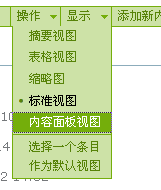

用户可通过文件夹的显示视图切换，直接使用预先定义一组内容面板的模板进行显示。在文件夹的 *显示* 下来菜单中，点击 *内容面板视图* ，显示如下的内容面板模板选择表单:

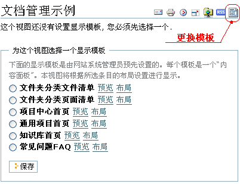

在上面的表单中，可点击模板后的 *预览* 链接，预览模板选用的效果，如果满意，可选择后点击保存按钮。
对于管理人员，可点击模板后的 *布局* 链接，调整模板的面板布局设置。

如果需要再次更换显示模板，可点击工具图标栏右边 *更换这个视图的显示模板* 图标，再次进入该表单。

创建内容面板
==================
如果默认的内容面板模板，还不能满足某个页面的个性化需求，可手工在该文件夹下创建一个内容面板，根据需要进行设置，并将这个内容面板设置为文件夹的默认视图。

添加内容面板
--------------------
在内容添加菜单中选择 *内容面板* ，进入内容面板编辑页面。在这个页面中，除了一般内容都有的英文代号、标题、描述输入项外，还包括如下输入项：

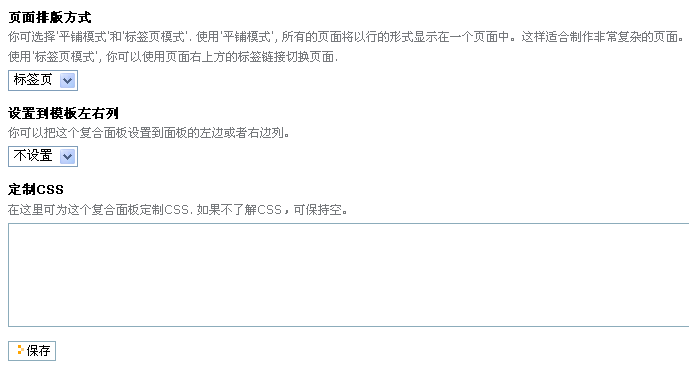

页面排版方式
  复合面板页面支持多页，多页可以以标签页和平铺两种方式显示。如果存在多个页面：

  - 使用标签页模式时，各个页面独立显示，在页面右上方将出现页面切换标签。
  - 使用平铺模式时，各个页面依次平铺在最终的查看页面中。

设置到面板左右列
  在这里，可将复合面板设置到模板的左面板列或者右面板列。设置完成后，改复合面板页面将在所设置的面板列上出现。

定制CSS
  可以定制该页面的CSS，这样可以显示更加个性化的外观。

点击保存按钮，保存当前的设置

调整面板布局
-----------------
面板页面是有一组面板组装而成的。

点击内容面板页面上方的 *面板布局* 标签，进入调整面板布局页面。新创建的面板包括1个面板页和2个面板列。

在这个页面中，可以添加删除面板页面、添加删除面板列、添加/删除面板、调整面板所在的位置。可将鼠标停留在各个图标上，查看各个图标的功能提示。面板布局调整界面如下：

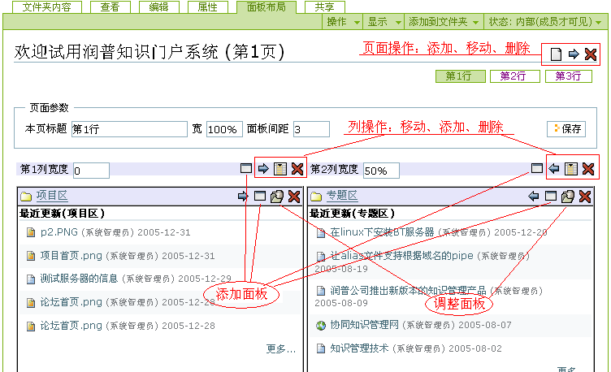

添加/编辑面板
-------------------
点击 *添加面板* 或者 *编辑面板* 图标链接，将弹出面板编辑窗口，如下图所示：

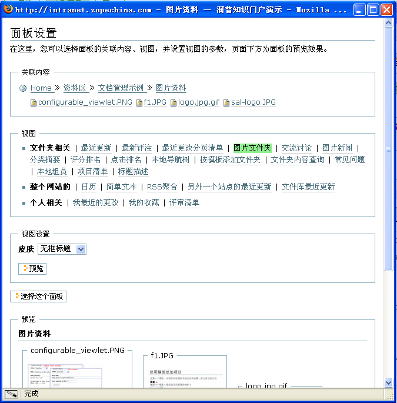

这个窗口用于设置面板的显示方式，需要分别选择模板的 *关联内容* 、 *视图* 和 *皮肤* ：

- 关联内容：每个面板的关联上下文内容
- 视图：内容的展现视图。不同类型的内容，可选择的视图是不同的。
- 皮肤：视图的显示外观

图中使用绿色加亮显示的是各个栏目的选中项，“预览”栏目是对面板效果的预览。选择完毕，点击“选择这个面板”，可将选中面板设置添加到内容面板页面中。

实例：显示文件夹的分类和最新评注
-------------------------------------
在文件夹中，添加一个内容面板，在 *编辑* 标签页面设置为右面板列，在其上添加两个面板：

- 分类统计
- 最近评注

效果如下:

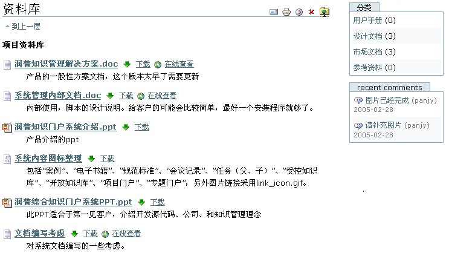

面板显示视图模板管理
===========================
点击任何一个内容面板的 *模板* 标签，在这里可进行内容面板显示视图的管理，如下图:

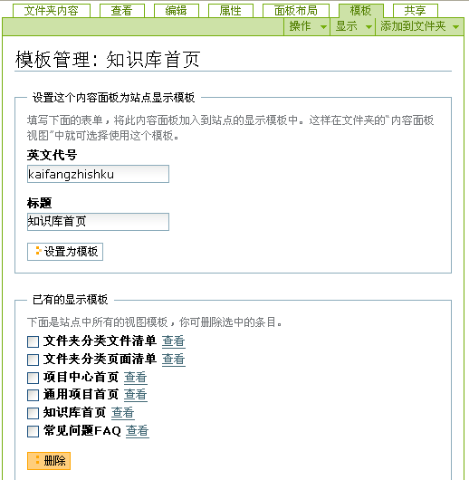

每个显示视图模板都包括一个 *英文代号* 和一个 *标题* ，在页面上方的表单中，可将当前的内容面板添加到网站的显示模板中，供其他文件夹使用。

在下面的表单中，可查看或者删除现有内容面板显示模板。

常用的面板视图
========================

本地导航树
--------------------
本地导航树通常放在项目、部门文件夹的左边列中，组织为网站的子栏目。

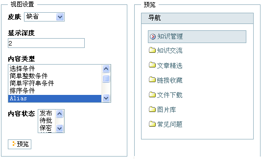

视图的设置选项主要包括：

显示深度
  在导航树上显示到哪一级别的文件夹

内容类型
  在导航树上显示的哪些内容类型
  
内容状态
  在导航树上显示哪些状态的内容

最近更新
---------------
此视图可展现文件夹下的内容最新更改清单：

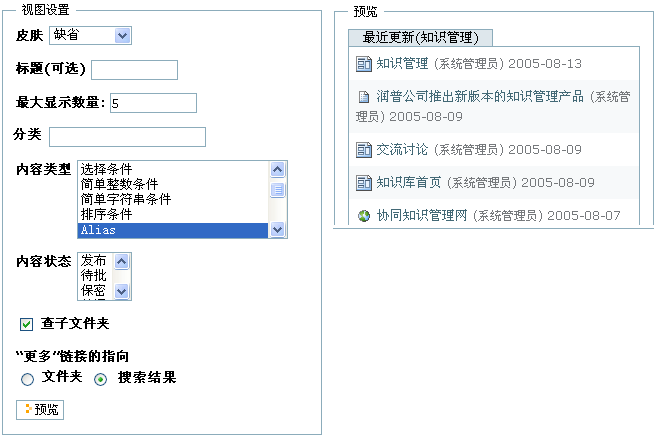

视图设置主要包括：

标题(可选)
  该视图设置一个标题。如果不填，将自动使用“最近更新(<文件夹名>)”的格式

最大的显示数量
  控制显示几条最近更新的内容

分类
  显示的内容应该包括那些分类
  
查子文件夹
  如果选中，则会包括子文件夹中最近更新的内容

“更多”链接的指向
  视图下方的“更多”链接将指向哪里，可指向到所在文件夹，或者一个查询结果页面

最近更改分页清单
-----------------------
此面板视图和“最近更改”视图类似，区别是不再使用“更多”链接，而是采用分页来显示。

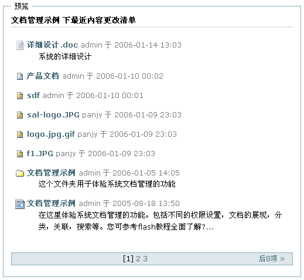

页面正文
--------------
在“关联内容”中选择一个页面，选择“页面正文”视图，可在面板中显示页面的正文:

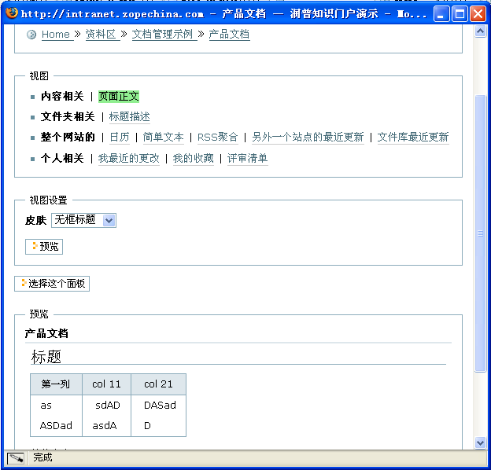

内容面板嵌套
--------------------
可将另外一个内容面板页面，整个作为一个面板

查询集视图
-------------------
使用 *查询集* 可构造比 *最近更新* 面板更加复杂的内容搜索条件，并提供了更多的显示方式。

可将查询集内容添加到面板中.

查询集使用示例：将网站所有最近发布的 *事件* 和 *新闻* ，作为公告显示出来。可如下操作：

1. 添加一个名字为 “公告” 的 *查询集* ；

2. 在 *条件* 标签页面中，

   - 添加3个条件:

     1) 位置 为 当前文件夹；
     2) 内容类型为 *事件* 和 *新闻* ；
     3) 状态 为 *发布*

   - 添加一个排序：按生效时间，反序排序

3. (可选步骤)在查询集的编辑页面中，可调整查询集采用表格显示方式。

分类相关的视图
----------------------
详见 *分类管理* 一节，包括：

- 分类摘要
- 分类列表
- 常见问题(FAQ)

评分和点击相关的视图
------------------------------
详将 *内容评分和计数* 一节，包括

- 投票评分排名
- 点击次数排名

典型的内容面板视图模板
========================================

文件分类清单
---------------------
分类显示文件夹的内容清单，并显示最近更改的内容清单。可直接点击分类后的添加图标，添加新的文件。

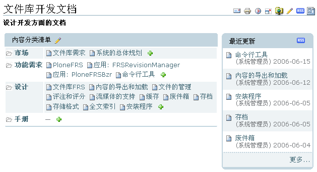

页面夹分类清单
---------------------
类似于 *文件分类清单*, 区别在于默认新添加的类型为页面。

知识库首页
-------------------
使用知识库首页，可将文件夹做为知识库使用，如下图所示:

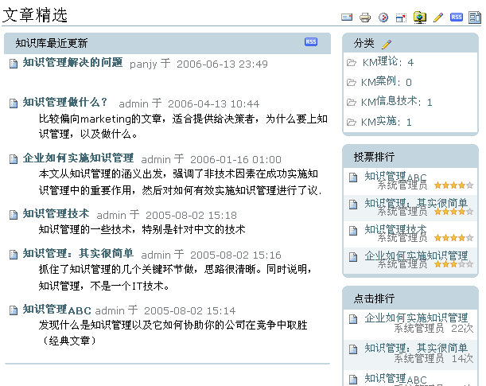

这个模板可展现文件夹的如下信息：

- 最近更新的内容
- 内容的分类和数量统计
- 投票评分的排行
- 点击排行
- 最近的评注

常见问题（FAQ）
--------------------
用于展现常见问题，如下图所示:

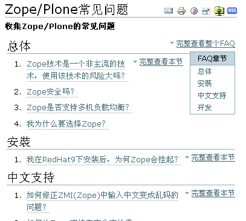

