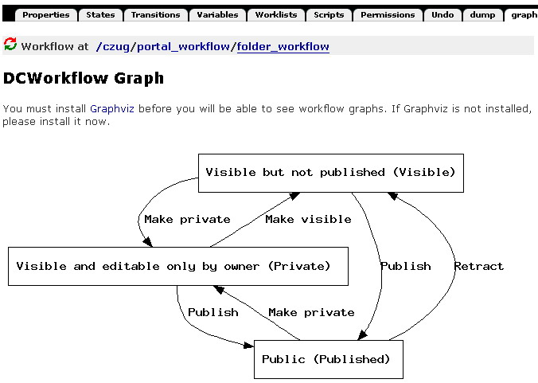

---
created:
  creators:
  - panjy
  description: 图形化的方法显示Plone的工作流
  modified: '2006-02-21 11:54:52'
  title: DCWorkflowGraph：Plone工作流图形化展示
creator: panjy
description: 图形化的方法显示Plone的工作流
title: DCWorkflowGraph：Plone工作流图形化展示
---
:产品名称: Plone工作流图形化展示（DCWorkflowGraph）
:许可类型: GPL开源许可
:发布类型: Plone扩展产品
:CMF版本: CMF 1.3以上
:操作系统: Windows, Linux, Unix
:免费下载: `dcworkflowgraph-0_2.tgz`__

__ http://www.zope.org/Members/panjunyong/DCWorkflowGraph

原理
======
- 根据工作流定义，自动生成Graphiz的dot格式文件
- 利用 Graphviz_ 生成流程图

安装
======

- 安装 Graphviz_
- 下载解压缩本产品到Zope实例的Products目录中
- 重新启动系统即可

使用
=======
- 在Plone的ZMI界面中，进入portal_workflow,  点击contents标签，选择一个工作流。
- 安装产品后，每个工作流都增加了一个Graph标签，点击该标签，可查看工作流图形，如下:

.. _Graphviz: http://www.graphviz.org
