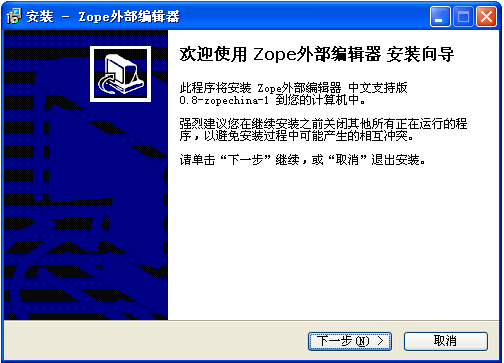

---
created:
  creators:
  - panjy
  description: 汉化的外部编辑器客户端windows安装程序，完全支持中文文件名。
  modified: '2006-08-09 08:57:26'
  title: 中文版Zope外部编辑器客户端
creator: panjy
description: 汉化的外部编辑器客户端windows安装程序，完全支持中文文件名。
title: 中文版Zope外部编辑器客户端
---
:产品名称: 中文版外部编辑器（ExternalEditor-zh）
:许可类型: GPL开源许可
:发布类型: Zope辅助客户端, 汉化补丁
:Zope版本: Zope 2.5以上
:产品版本: 0.9.1-zh-2
:操作系统: Windows
:免费下载: `zopeedit-win32.exe`__

__  http://download.zopen.cn/zopeedit-win32-0.9.1-zh-2.exe

zope外部编辑器可将zope/plone和桌面编辑器集成起来，简化文件的下载、编辑、上传流程。 

本产品是对 `External Editor`_ 的汉化改进，主要特性包括：

- 全中文的安装程序
- 支持中文文件名
- 避免由于文件太长导致的问题
- 更好支持word文件的编辑
- 其他的中文相关的编码错修正

.. _`External Editor`: http://www.zope.org/Members/Caseman/ExternalEditor
