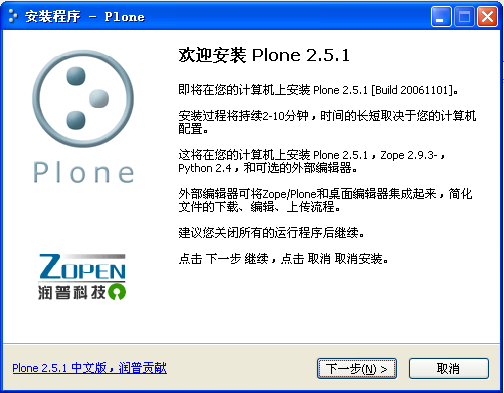
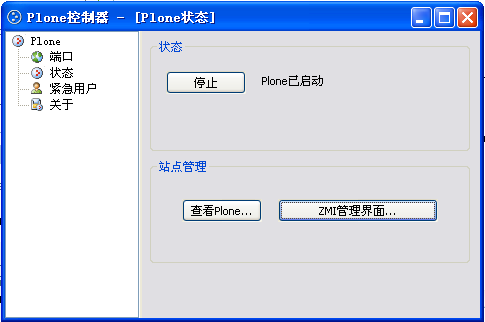

---
created:
  creators:
  - panjy
  description: windows上的即装即用全中文Plone安装程序
  modified: '2008-01-21 00:12:25'
  title: Plone中文版windows安装包
creator: panjy
description: windows上的即装即用全中文Plone安装程序
title: Plone中文版windows安装包
---
Plone是一个用户界面友好、功能强大的内容管理系统(CMS)。Plone适合用作内部网/外部网的服务器、文档发布系统、门户服务器和异地协同的群 件工具。
`Plone是什么... </technology/zope/AboutPlone/>`__

这个安装程序是傻瓜型的，在windows上的即装即用的、完全中文化的安装程序。根据机器性能，只需要4-9分钟，便可下载安装完成。Plone中文版windows安装包将大大降低中文用户进入Plone的门槛，加速Plone在中文地区的推广。

特性清单
=====================
- 基于Plone的最新版本
- 全中文的安装界面
- 中文版本的Plone控制器，用于启动和管理Plone服务
- 自带中文版本的外部编辑器，可选安装
- 自带最新版本的ZopeChinaPak和CJKSplitter中文支持插件
- 自动创建全中文的Plone站点，支持中文全文搜索
- 自带CMFContentPanels、Ploneboard等社区常用产品（可选安装）
- 中文的使用和开发chm电子书籍链接

下载
==================
`选择镜像站点下载plone2.5... <http://prdownloads.sourceforge.net/zopeasia/plone-2.5.1-zh-setup-1.exe?download>`__

`选择镜像站点下载plone3.0... <http://downloads.sourceforge.net/zopeasia/plone-3.03-zh-setup-2.exe?modtime=1198172363&big_mirror=0>`__

.. `为应付海底光缆中断的临时本地下载... <http://download.zopen.cn/plone-2.5.1-zh-setup.exe>`__

截图
==========

全中文的安装程序

中文版本的Plone控制器

安装好的中文化Plone首页

版权说明
============
- Plone的版权由Plone基金会所有
- 其他打包产品版权归各自所有者
