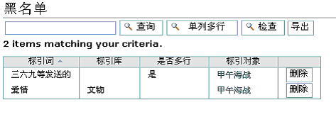

---
created:
  creators:
  - panjy
  description: 直接在Plone的友好界面下，无需任何专业编程知识，便可实现Plone内容的扩展和外观定制。系统支持多层次的内容语义定义、索引管理、内容标引管理，以及内容模板、查询模板的设计，可自动生成内容查询表单。
  modified: '2006-08-09 08:56:16'
  title: 'rpSchema: Plone可视化内容语义和模板系统'
creator: panjy
description: 直接在Plone的友好界面下，无需任何专业编程知识，便可实现Plone内容的扩展和外观定制。系统支持多层次的内容语义定义、索引管理、内容标引管理，以及内容模板、查询模板的设计，可自动生成内容查询表单。
title: 'rpSchema: Plone可视化内容语义和模板系统'
---
:产品名称: Plone可视化内容语义和模板系统（rpSchema）
:许可类型: GPL开源许可（计划中）
:发布类型: Plone扩展产品，包括SchemaEngine和SchemaTemplate
:Plone版本: Plone 2.0
:产品版本: 0.9beta
:操作系统: Windows, Linux, Unix, Mac OS
:下载:  (暂不提供)

.. Contents:: 功能清单：

基本术语
=========
库
  一个独立的内容类型，也就是Plone内容管理系统中的内容类型(Portal Type)对应。

语义模型(Schema)
  定义数据的层次结构，存储格式，约束条件，显示方法等。一个库可以由多个语义模型描述。

库模板
  库的展现外观模板。库内容可以动态选择库模板。

查询模板
  查询结果的外观定制模板

SchemEngine: 强大的语义引擎
===============================
库管理
----------------

库清单
  库管理的入口界面，可查看各个库的语义模型、库模板、查询表单生成器、库数据

导出库
  可将库的定义、元数据、模板数据全部导出系统。导出的库可发放到其他的系统，自动导入。

自动生成库模板
  根据库语义模型自动生成库模板

删除和添加库
  删除现有库，或者添加新的库

库语义定义
-----------------
一个内容类型可支持多个语义模型
  可轻松支持元数据，支持语义模型的重用

完备的基本域结点类型
  和Archetypes类似，包括单行文本域、多行文本、图片、文件、选择域、多选、多值

支持多层次的语义模型
  系统支持“组合类型”和“容器类型”域结点，支持类似XML的多层次的语义模型和重复结点的定义。

域结点支持扩展
  可扩展开发，支持更多类型的域结点

支持内容的标引
  通过标引关键字，自动建立内容直接的引用关系，自动生成永久链接。系统能够自动识别、禁止失效标引，提供失效标引(标引黑名单)的管理界面。

支持域结点别名定义
  同类型的基本域节点之间可定义Alias关系。当一个数据为空的时候，将从其Alias节点中读取数据。别名的定义，使得元数据自动获取成为可能。

索引设置
  一个域结点可以进入一个或者多个索引，包括全文索引。系统预先定义一组索引，索引类型可为Zope的ZCTextIndex、FieldIndex、KeywordIndex、DateIndex等。

输入约束条件
  包括值唯一和必输等约束条件

动态缺省值
  支持使用TALE表达式，定义动态缺省值

SchemaTemplate：所见即所得的模板系统
===========================================
自动生成内容模板
------------------
系统可根据Schema定义，自动生成内容模板，包括编辑录入表单模板和查看外观模板。

录入表单支持分页录入。

`点击看大图`__

__ img/schema-edit-md.png

模板外观设计
-------------
直接设置css属性，调整模板外观。也可以编写定制的css脚本实现更加灵活的css定制。

模板中各个域结点的布局，可直接在web界面上调整，而无需编程。

.. image:: img/schema-template.png
   :width: 450
   :alt: 库模板布局调整

`点击看大图`__

__ img/schema-template.png

动态模板选择
------------
支持一库对应多种模板。

查询模板支持
--------------
根据所在位置不同，定义不同的查询模板

查询表单自动生成
------------------
根据库的语义模型，系统自动生成符合Plone查询接口的查询表单html代码，方便制作查询表单
