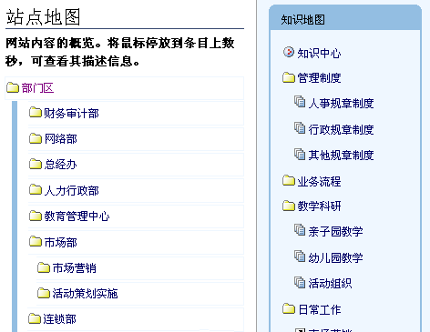
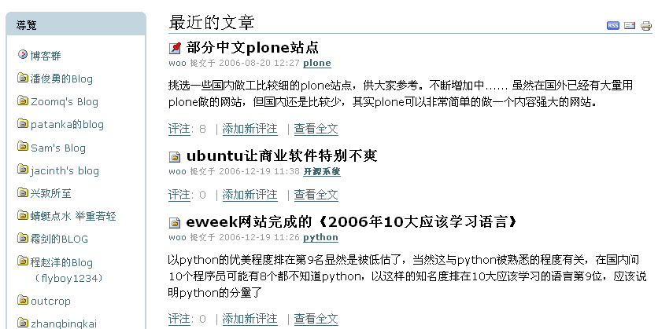

---
created:
  creators:
  - panjy
  description: 面向知识型企业和组织，以文档管理技术为基础，构建企业的统一知识门户，沉淀组织知识，鼓励员工知识分享，协助企业构建学习型组织，提升组织智力。
  modified: '2007-02-05 09:33:29'
  title: 企业知识管理门户
creator: panjy
description: 面向知识型企业和组织，以文档管理技术为基础，构建企业的统一知识门户，沉淀组织知识，鼓励员工知识分享，协助企业构建学习型组织，提升组织智力。
title: 企业知识管理门户
---
.. sectnum::
   :depth: 1

.. image:: /images/consultant.gif
   :class: image-left image-noborder

企业需要知识管理
====================

随着知识经济时代的到来，企业在竞争中对机会的把握，越来越取决于组织的智力和知识。特别的，在知识型企业和组织中，知识资产的价值远超过物质资产，是企业的核心竞争力。

如何有效的管理组织的智力和知识资产，为企业创造价值，正逐步为各企业所重视。知识管理正是在这样的商业背景驱动下产生的。知识管理的内容，包括对知识的清理、评估、监督、规划、学习、整合、存储、创新、保护、获取、共享、传播等各个环节。

通过知识管理，企业通常希望实现如下商业目标：

- 鼓励共享和交流，培育创新精神，进而构建构建学习型组织；
- 通过减少反应时间，提升客户服务质量；
- 快速向市场提供产品和服务来提高收入；
- 识别雇员的知识价值，给以相应报酬，从而提高雇员留职率；
- 减少多余或不必要环节，让流程自动化，精简操作，降低成本；

.. image:: /images/support.gif
   :class: image-left image-noborder

企业知识管理的困境
=====================

企业知识管理过程中，通常存在如下问题：

知识分散难获取
  企业的大量知识，分散保存在各个服务器、各个系统，个人电脑，甚至个人的头脑中。知识难以获取，导致工作效率低下，工作出现重复劳动。知识缺乏全局的、系统的视图，缺少关联，新员工上手难。

地域分布难协同
  组织中的各个部门、办事处或子公司在地理上分散，导致沟通、知识共享和协同工作困难，流程运转不畅，工作效率低下。

知识易流失
  一些重要的知识，还处于隐形知识形态，仅仅位于少数员工的头脑中，没有显性化沉淀下来。员工的流失，会直接导致企业知识的流失。

知识资产难保护
  知识的共享和保密是一个冲突。如何让知识被正确的人获取，同时减少管理的复杂性，是企业知识管理的一个难题。

知识质量难评估
  知识不是静态的，知识可能快速老化需要不断更新。企业往往缺乏对知识质量评估和有效性识别机制，过时的知识需要更新，错误的知识需要剔除，同时能够挖掘出优质的知识。

员工排斥知识管理
  额外的知识管理工作增加了员工的工作量，员工知识贡献的积极性不高。这和公司的文化、制度也有关系。知识管理，必须让知识工作者工作更容易才更容易推行。

领导难管理
  企业需要相关信息系统来简化知识管理工作；同时，通过知识管理的一些统计数据，对员工进行评估考核，激励员工贡献，构建鼓励知识贡献的文化氛围。

.. image:: /images/application.gif
   :class: image-left image-noborder

润普企业知识门户
=====================
知识管理本身是一种商业实践，而不是一门技术，但是它需要需要各种IT技术支持。

润普公司的企业知识门户解决方案，面向知识型企业和组织，利用Zope/Plone等成熟的开源内容管理技术，遵循知识管理的客观规律，提供了一组知识管理工具，结合润普公司在企业企业知识方面的丰富经验，为企业构建一个易用的、功能强大的、可扩展的知识管理信息网站平台，帮助企业更有效地进行知识管理。

系统满足如下几类用户的需求：

- 知识经理和公司领导：

  - 了解知识积累和沉淀的情况
  - 了解人员的知识贡献情况，激励知识贡献
  - 了解知识管理人员的工作效果，激励完善知识管理
- 知识管理人员：知识的分类、组织、展现、清理、审核
- 知识工作者：知识提交、修改、讨论
- 知识用户：从系统中获取知识，如查找、订阅、阅读等
- 系统管理员：系统级别的管理工作

.. image:: /images/outsourcing.gif
   :class: image-left image-noborder

各种知识管理工具和方法
================================

统一集中的知识存储（沉淀）平台
--------------------------------------
知识工作者将以知识门户作为核心的工作平台，用户可轻松上线使用。同时系统完善的备份机制，确保知识可靠存储，这可促进企业知识的沉淀和固化。

常见的知识形式包括页面、文档、资料、图片、链接等。系统特别针对企业常用的办公文档（如Word、Excel、PPT、PDF等格式），进行特殊的支持。

知识组织管理的单位包括文件夹、知识库、知识专题等。

个性化的知识动态首页
---------------------
网站或者栏目的首页通常是一个综合性的页面。首页信息十分丰富，自动更新为最新的信息，推送给所有访问用户。

.. image:: /cases/sal/pic/Snap7.jpg
   :target:  /cases/sal/pic/Snap7.jpg
   :width: 250

系统采用 `内容面板 </products/open/CMFContentPanels>`__ 来构建首页，系统管理员可轻松调整首页内容和布局。图中首页的内容包括：

- 各个版面的最近更新内容
- 贡献排名、点击排名，鼓励知识贡献
- 新闻和日程安排，特别是知识管理方面的新闻
- 投票，促进管理

多角度的知识组织
-----------------------
知识的组织，需要满足管理和使用这两方面的要求。

通常，知识的管理和维护是按照公司的组织结构为单位开展的，和日常工作紧密结合的。知识以公司组织结构的方式来组织，更加能够突出知识的归属关系，便于激励公司各个单位加强知识管理建设。典型的比如为总经办、网络部、财务部、开发部、测试部，甚至科室、小组，分别建立自己的门户。

另一方面，知识的使用，却应该突破公司组织结构的壁垒，能够直接根据知识的分类来组织，便于快速查找定位到知识。比如可根据公司的各个业务来组织各个部门的相关知识。

系统提供查询集、快捷方式等多种手段，可让同一个内容，在网站的不同栏目出现。

便捷的知识获取途径
--------------------
统一的知识访问入口，构建（显性）知识获取平台。系统提供导航、地图、面板、搜索、邮件推送等各种手段来展现和获取知识，同时也可以和企业现有的系统集成，构建统一的知识访问入口，方便知识的获取。

常用的知识获取途径包括：

查询检索
  系统支持强大的全文检索功能，这一般能满足通常的检索需要。另外，系统也支持根据分类、根据作者、时间、位置、状态、内容类型等条件进行检索，更加精确的定位内容。

知识地图
  网站自动生成知识地图，获得整个网站的全面的视图。

RSS
  通过RSS，可离线订阅阅读更新的知识。

网站导航
  通过类似Windows资源管理器的网站导航树，帮助您定位知识。

强大的文档管理功能
----------------------
企业大量的知识是以Word、Excel、PPT、PDF等格式的文档形式存在。文档管理是知识管理的基础。系统提供全面的文档管理功能，能够提升工作效率，更好的获取知识。

我们采用成熟的 `ZOpen EDM企业文档管理系统 </products/edm>`__ 来进行文档管理。

建立流畅的沟通渠道
---------------------------------------------------
.. sidebar:: 概念: 隐形知识

   隐性知识是指储存在人们的大脑里，难以文字描述的经验知识，需要经过人际互动才能产生共识的组织知识。难以识别、分享。IT技术可辅助传播，如论坛、邮件、聊天工具。

系统提供各种沟通交流手段，可方便挖掘员工头脑中的隐性知识，提供知识的传播渠道，建立知识创新的温床。具体包括：

知识评注
  可直接评注各种形式的知识，评注信息可通过邮件发送到作者。

  .. image:: /products/edm/img/comment.png
     :target: /products/edm/img/comment.png

论坛
  论坛是比较轻松和非正式的信息发布和交流平台，可鼓励员工发言。

  .. image:: img/forum.png
     :target: img/forum.png
     :width: 250

邮件列表
  邮件列表适合群组讨论，发送到邮件列表的悠久，自动转发到所有订阅人员，同时在网站上对悠久进行自动存档。

  .. image:: img/maillist.png
     :target: img/maillist.png
     :width: 250

聊天室
  系统提供聊天室功能，可轻松创建新的聊天室，利用互联网进行网络沟通、交流。

即时沟通集成
  在查看文档的时候，可以直接显示作者的MSN、QQ或者skype号码，可点击和作者进行即时交流。

显性知识的管理
--------------------
.. sidebar:: 概念: 显性知识

   显性知识是指归档的、标准化的、系统的知识，能重复使用，可与人分离的知识。能通过计算机进行整理、归档和储存。如：专利、商标、商业计划、市场研究等.

显性知识也就是正式的知识。根据不同的应用场合，显性知识的管理可采用不同的工具:

wiki
  适合百科全书类型的知识，适合用作词汇的解释，可作为相关知识的入口。Wiki也非常鼓励参与，一般任何人都可参与维护Wiki的内容。

知识库
  知识库是相对正式的知识存储单位，一般有明确的主题，由专人负责管理，指定人员可提交知识，知识可能需要审核后才能发布。

  .. image:: img/kb.png
     :target: img/kb.png
     :width: 250

常见问题
  常见问题适合发布产品支持方面的知识，通常由专人整理，供最终用户查阅使用。

  .. image:: img/faq.png
     :target: img/faq.png
     :width: 250

知识专题
  知识专题是采用多个知识管理工具，综合的说明某个专题的内容。对于比较复杂的知识，可建立知识专题来管理。

  .. image:: img/ksection.png
     :target: img/ksection.png
     :width: 250

企业博客
-----------------------
企业博客是企业领导或者员工发布个人信息的平台。

企业博客是公司员工沟通的很好的渠道。比如领导可通过自己的博客，发布一些动态的、非正式的想法；个人也可以及时的说出公司的管理方面的问题；技术人员可发布技术心得，相互交流，同时树立个人品牌。

灵活易用的权限管理
------------------
Plone拥有完善的权限管理机制，能够确保文档和知识的安全性。

Plone 支持成组授权，支持权限委托管理，支持协同工作。

知识管理责任到人
-------------------
通过信息系统，将知识管理的任务责任到人。职责清晰，是优化管理的第一步。

系统支持动态构建项目、知识专题、部门等版面，分别由项目经理、技术专家、部门知识管理员来负责组织和管理知识。

同时系统提供各个版面的统计功能，可分析版面的知识构成、进展、版面的利用情况等，以评估知识工作者的工作。

提供知识的审批、评估和挖掘机制
------------------------------
知识审批流程
  知识发布需要通过管理人员的审批，以确保知识的有效性。

知识评估
  系统支持知识评分、知识点击分析、知识讨论评注，来实现对知识的评估。

知识挖掘
  根据知识的评估情况，系统支持对优秀知识和过时知识的挖掘，提供信息给用户和知识管理员，便于知识获取和知识的清理。

.. image:: /products/edm/img/mining.png
   :target: /products/edm/img/mining.png

知识统计
---------------
系统支持完善的统计分析功能，支持两种分析：

1. 对知识资源的统计分析，包括：人员的知识贡献排名，可激励知识贡献；各个版面的内容分布；

2. 用户访问情况的分析，包括：哪些内容版面受欢迎；哪些人员经常使用系统等信息；系统的整体使用情况；各个月的访问情况变化；

.. image:: /products/edm/img/month-stats.png
   :target: /products/edm/img/month-stats.png

柔性可扩展
--------------------------
系统采用 `开源内容管理系统Plone </zope/AboutPlone>`__ 构建，拥有良好的可扩展性。Plone拥有大量的扩展插件产品，并不断发展，可满足用户不断扩展的各种需求。

在知识门户中，可以根据企业需要，提供其他的扩展应用，比如问卷、考试、投票、产品帮助中心、故障跟踪、项目管理等。
