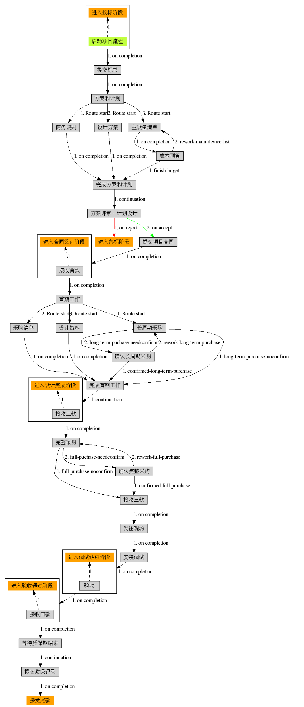
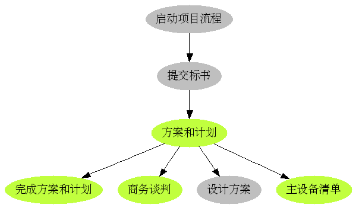

---
created:
  creators:
  - admin
  description: 将公司的项目流程规范植入信息系统，自动化项目流程和文档审批流程，项目人员面向流程任务工作，驱动项目流程扭转；项目流程、项目阶段、项目文档能够有机结合在一起，给公司管理人员全面的项目信息。
  modified: '2006-12-22 01:53:21'
  title: 工程项目管理门户
creator: admin
description: 将公司的项目流程规范植入信息系统，自动化项目流程和文档审批流程，项目人员面向流程任务工作，驱动项目流程扭转；项目流程、项目阶段、项目文档能够有机结合在一起，给公司管理人员全面的项目信息。
title: 工程项目管理门户
---
工程项目通常有严格的流程规范。项目组员来自各个部门，项目流程运转自动分派任务，驱动项目进入不同阶段，各个阶段提交不同的文档。各个文档有严格的审批流程。

项目的流程管理，建立项目生产的流水线，自动化项目运作流程；项目的文档资料的集中存档，分权限共享；可在系统中对文档进行审核发布，即便出差，员工可以通过网络办公。

工程项目管理的困惑
=========================

项目的运作不透明，不可预期

1. 计划性不强，进度控制不好
2. 可追溯性差
3. 成本没有很好的预算
4. 项目各部分的接口不一致
5. 效率低，犯重复性错误

项目流程管理
==================
通过项目的流程管理，建立项目生产的自动化流水线，项目文档类似需要装配的零部件，技术员就是生产线工人，保证项目完成质量的跟踪，进度的可控，接口的统一性. 项目在部门内部，部门之间能顺利交接，实时显示进度。一个项目从开始到结束，中间发现的事都可以在网内记录，查处。

1. 流程是一项目合同的履行为主线的；
2. 以合同执行中产生的各种数据（文档，图纸等）为基础；
3. 显示任务的分配： ``公司 -> 部门 -> 小组 -> 个人`` ；保证责任到人，运作的可追述性；

系统用户
==============
公司领导
  主要是宏观监控，当前有多少项目，各自在什么状态，当月的计划怎样，等等；

  项目可分为如下阶段：投标、合同签订、设计完成、安装结束、调试结束、验收通过

项目经理
  本项目进行到什么阶段了，是否可以按时完成，各个小组成员的任务怎样，是否可以参与新项目，等等；

  直观显示项目的进行过程，项目的运作流程能在这个平台上客观地反映出来。项目出现运作问题时，可以逆追踪到原因。

项目成员
  参与项目的人员知道自己的任务，计划。项目与己相关部分的进展，等等；

流程引擎
====================

- 有顺序执行的
- 回退的

  - 采购部如果觉得清单不合理，可以把清单回退到设计部修改
  - 采购部完成采购后，转到工程部门验收，或者直接发货到现场

- 跳转的
- 可以设置时间门限，比如，即便审核都通过了，还要到达某个日期后，才自动下达采购任务, 到时间后，还有自动提示功能
- 一定的灵活性，允许流程变化

- 流程图显示

  可分别查看定义的流程图和执行的流程图，有颜色区别，如绿色代表已经执行，红色代表延期，灰色代码还没到达，等等

文档和图纸的审核
==================
图纸的一般审核流程为::

   设计人员 -> 校对 -> 项目负责人审核 -> 总师批准

文档、图纸的审核，是和项目所处理的阶段有关系的。
项目中某步骤的文档的正式提交后，可以自动驱动项目流程走向下一阶段的。
