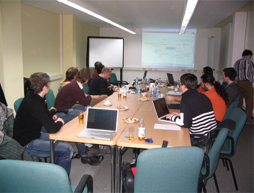

---
created:
  creators:
  - panjy
  description: 润普公司提供Python/Zope/Plone技术培训
  modified: '2007-04-24 03:42:25'
  title: 润普Python/Zope/Plone培训
creator: panjy
description: 润普公司提供Python/Zope/Plone技术培训
title: 润普Python/Zope/Plone培训
---
专业培训
============

润普公司在中文Python/Zope/Plone开源技术领域处于领导地位，同时培育和储备了优秀的技术人才。润普通过专业的培训，让您同我们一起分享Python/Zope/Plone的成功开发经验。

培训课程
============
润普提供 `Plone基础培训 <plone-basic>`__ 、 `Plone扩展开发培训 <plone-advanced>`__ 和 `Python基础培训 <python-basic>`__ 公开课程。如果贵公司需要更加个性化的Plone培训内容，我们也可以提供针对性的上门培训服务。

培训课程特点
===================
基于Plone/Zope/Python的最新版本
  培训内容更加有效，着重培训Plone/Zope/Python目前和将来版本使用的技术，对过时和不推荐的技术则一笔带过。

全面的培训
  提供从使用、定制、脚本开发、扩展开发到系统管理的全面培训。

培训和实践结合
  润普公司结合实例进行讲解，每次课程结束后，为学员准备了练习作业。次日对练习作业的答案进行讲解。

丰富的培训资料
  讲师事先准备详细的培训讲义，我们准备了大量的练习实例、原理图、配置和管理脚本文件；所有授课时使用的培训资料均免费提供给学员使用。

培训客户
==============
润普公司为 `中国石化工程建设公司`__ 、 `中华人民共和国文化部`__ 、 `广州网易`__ 、 `光大银行南京分行`__ 、 `南海发展`__ 、 `通用机械研究所`__ 、 `瑞声达集团`__  等单位提供了Zope、Plone以及Python等培训服务，积累了丰富的授课经验。

__ http://www.sei.com.cn
__ http://www.ccnt.gov.cn/
__ http://www.163.com
__ http://www.cebbank.com/
__ http://www.nhd.net.cn
__ http://www.hgmri.com
__ http://www.gnresound.com.cn/