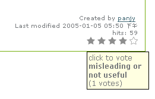

ATRatings is a tool for storing user ratings and hits on objects for Archetypes
based content.

ATRatings uses a pluggable storage mechanism for rating data.  So far I have
written a ZODB-based storage that strives to be reasonably efficient with
memory.

ATRatings makes use of references and hence requires Archetypes.  It indexes
stored ratings using object UIDs, so until UIDs are backported into the CMF,
you can only rate Archetypes-based objects.

NOTE: This products works for Archetypes based content only. So it is a product
for Plone 2.1 which is based on ATContentTypes.

This product is hosted at: http://cvs.sf.net/projects/collective

Screen shots
---------------

How to use it?
----------------------------
1. Enable ratings and click counting

   ATRatings disabled such functions by default. You should go to ZMI inface of
   the folder where you want to enable them. Click the Properties tab, and add 2
   boolean properties:

   - enableRatings : enable ratings for contents in the folder
   - enableCountings : enable click countings for content in the folder

2. Once enabled, you can view ratings and vote at the plone's document_by_line.

3. Simple rating statistics.

   Add 2 portlets in your left_slots or right_slots::

      portal/path/to/your/folder/portlet_top_ratings
      portal/path/to/your/folder/portlet_top_countings

   You can also use similar viewlets with CMFContentPanels if you intalled.

4. You can control who can vote by permission: "ATRatings: Add rating".

5. You can control what can be rate / hit count by portal_ratings 2 properties:
   'allowed_rating_types' and 'allowed_couting_types'.

CREDITS
--------------
- Geoff Davis (geoff at geoffdavis dot net): original creator

- panjunyong(panjy at zopechina.com) bug fix, UI, make it work

