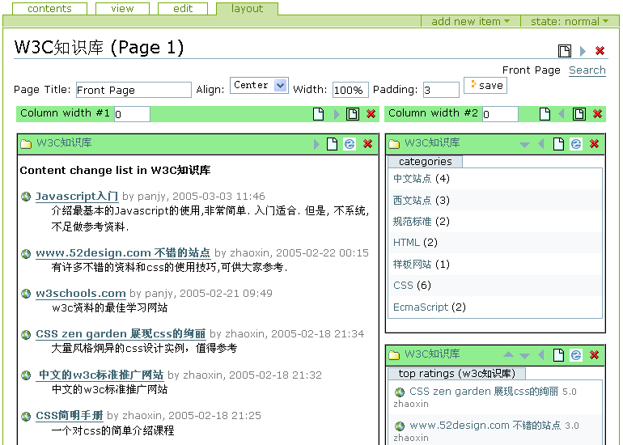

:product: CMFContentPanels
:license: GPL
:category: Plone layout and presentation
:Plone version: Plone 2.0
:version: 1.8.3
:os: Windows, Linux, Unix, Mac OS
:download: `contentpanels-1_8_3.tgz`__

__ http://download.zopechina.com/contentpanels-1_8_3.tgz

.. Contents::

Features
================
* support multi-page and mulit-column
* full function layout management, easy to use: move panels left/right/up/down
* construction of very complex page: contentpanels can be nested within  another contentpanels.
* extensible css panel skin. 4 skins provided by default. Select or extend the skin as you like.
* plone portlet compatible viewlets. easy to extend.
* integrate with plone's default portlets, add some new portlet like 'my recent changes'.
* predefined viewlets for Document, Image, Folder, Topic, ZWiki Page, PloneChat, mxmDynamicPage.
* suport relative content path
* contentpanels content can be a plone portlet and show on the left/right column.
* support multi-rows: use 'tile' page layout mode, and each page becomes a new row!

Screen shot
============

`click to view full screen`__

__ cp-layout-en.png/image_view_fullscreen

`More...`__

__ screen-shots

How to Extend CMFContentPanels? (For Developers)
=================================================
How to make more viewlets?
--------------------------------
Viewlet is a view of content which can be selected in contentpanels. Viewlet can be a zpt or a zpt macro. Viewlets are registered with CMF Action mechanism.

1. Write a viewlet for your content.  Viewlet structure is the same to  `Plone 2 portlet`__. You can refer to stuff at \CMFContentPanels\skins\contentpanels\viewlets, where are default viewlets.

2. Add a new CMF action with the CMF Action mechanism. Remember, the action catalog should be 'panel_viewlets'. See the Install.py for detail.

__ http://plone.org/Members/arnia/plone2-css-reference/Portlets/wikipage_view

How to add new panel skin?
-----------------------------
You can define a new css wrapper to define a new panel skin:

1. customise contentpanels_skin.css.dtml, write your new css wrapper there

2. go to ZMI 'portal_contentpanels', in the properties view, add your new wrapper there.

Credits
=================
* `ZopeChina.com`__

__ http://www.zopechina.com

* ausum's CMFPortlets_: many idea comes from CMFPortlets. Thanks!

.. _CMFPortlets: http://www.zope.org/Members/ausum/CMFPortlets 

Bug report and feature request
====================================
CMFContentPanels is in Collective_ now. you can report bugs and request new feature there.

.. _Collective: http://sourceforge.net/projects/collective